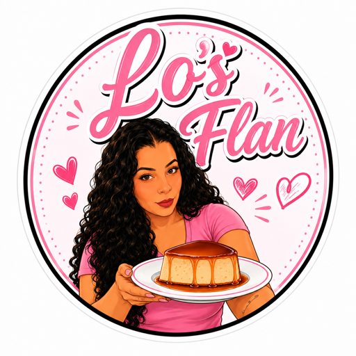

# Lo's Flan — Cinematic Luxury Flan Experience

> **The Journey of a Perfect Flan** — An immersive, scroll-driven brand experience combining cinematic 3D storytelling with premium ecommerce.

> **🌐 Live site:** <https://kenclarkz.github.io/Lo-Flan/>



---

## ✨ Features

### Cinematic Homepage Experience
- **6 scroll-driven chapters** telling the flan journey: Hero → Ingredients → Blending → Pouring → Baking → Reveal
- **Photo-driven** — drop a photo per chapter into `public/assets/journey/` and it replaces the placeholder automatically (no code changes)
- **Fire burn transitions** — a full-screen WebGL layer shows the current photo and, when you scroll to the next chapter, consumes it with a flame-edged fire effect (char ahead of the flame, rising embers, warm flash) revealing the next photo
- **3D product reveal** — the final chapter spins your Blender flan model (`/assets/flan/flan.glb`) over the reveal photo
- **Elegant built-in placeholders** with the chapter numeral until real photos are added
- **Smooth scrolling** via Lenis
- Scroll-linked text reveals, status/progress overlays, and a final CTA — all driven by scroll position
- **Big "Order Now" button** pinned over the scrolling video that opens your Facebook Messenger to order — the Messenger link is configurable from the admin control panel (or set in `data/site.ts`)
- A `components/three/` library (Three.js/R3F) remains available for future 3D scenes

### Premium Ecommerce (`/products`)
- **Modular product data** in `data/products.ts` — add products by appending objects
- **Category filtering** (Classic, Specialty, Seasonal, Party, Gift)
- **Size selection** with per-size pricing
- **Quick-view modal** with ingredients, allergens, quantity
- **Cart drawer** with localStorage persistence
- **Stripe-ready** checkout placeholder

### Additional Pages
- `/about` — Brand story, timeline, values, process
- `/contact` — Contact form, hours, catering & wholesale inquiries

---

## 🛠️ Tech Stack

| Layer | Technology |
|-------|------------|
| Framework | Next.js 14 (App Router) |
| Language | TypeScript 5.6 |
| Styling | Tailwind CSS 3.4 |
| 3D | Three.js r160, React Three Fiber 8.17, Drei 9.114 |
| Animation | GSAP 3.12 + ScrollTrigger |
| Smooth Scroll | Lenis 1.1 |
| Icons | Lucide React |
| State | React Context + localStorage |

---

## 🚀 Quick Start

```bash
# Install dependencies
npm install

# Development server (serves under /Lo-Flan to match GitHub Pages paths)
npm run dev        # → http://localhost:3000/Lo-Flan

# Static export build (see 📦 Deployment)
npm run build
npx serve out      # preview the exported site (serves /Lo-Flan/...)

# Lint & typecheck
npm run lint
npm run typecheck
```

---

## 📁 Project Structure

```
├── app/
│   ├── page.tsx                 # Home (cinematic experience)
│   ├── products/page.tsx        # Ecommerce menu
│   ├── about/page.tsx           # Brand story
│   ├── contact/page.tsx         # Contact form + info
│   ├── layout.tsx               # Root layout + providers
│   └── globals.css              # Design system
├── components/
│   ├── Experience.tsx           # Scene composition
│   ├── ScrollController.tsx     # Lenis + GSAP + progress bar
│   ├── OrderNowButton.tsx       # Fixed Messenger order button (admin-configurable link)
│   ├── HeroFlan.tsx             # Scene 1
│   ├── IngredientExplosion.tsx  # Scene 2
│   ├── BlenderScene.tsx         # Scene 3
│   ├── BatterPour.tsx           # Scene 4
│   ├── OvenScene.tsx            # Scene 5
│   ├── FinalProduct.tsx         # Scene 6
│   ├── JourneyFireCanvas.tsx    # WebGL fire-burn photo backdrop
│   ├── ProductCard.tsx          # Ecommerce card + quick view
│   ├── ProductGrid.tsx          # Filtered grid
│   ├── CategoryFilter.tsx       # Category pills
│   ├── PriceDisplay.tsx         # Formatted pricing
│   ├── Navigation.tsx           # Header nav + cart button
│   ├── Footer.tsx               # Footer + newsletter
│   ├── CartDrawer.tsx           # Slide-over cart
│   ├── Reveal.tsx               # Scroll-triggered fade/slide
│   ├── SceneShell.tsx           # Pinned section wrapper
│   └── three/                   # 3D primitives
│       ├── FlanModel.tsx
│       ├── BlenderModel.tsx
│       ├── PanModel.tsx
│       ├── OvenModel.tsx
│       ├── Ingredients.tsx
│       ├── Steam.tsx
│       ├── Lighting.tsx
│       ├── GatedCanvas.tsx
│       ├── ModelOrFallback.tsx
│       ├── GlbModel.tsx
│       └── math.ts
├── data/
│   ├── products.ts              # Product catalog (source of truth)
│   └── site.ts                  # Site config, nav, chapters
├── lib/
│   ├── anim.ts                  # GSAP + ScrollTrigger setup
│   ├── lenis.ts                 # Lenis singleton + integration
│   ├── usePinnedScene.ts        # ScrollTrigger pin + progress hook
│   ├── cart.tsx                 # Cart context + persistence
│   ├── assets.ts                # Asset existence detection
│   ├── textures.ts              # Procedural texture generators
│   └── utils.ts                 # clsx helper
├── public/assets/
│   ├── brand/logo.png             # Business logo (nav, footer, favicon)
│   ├── products/*.svg           # Product card images
│   ├── journey/                 # Drop chapter photos here (hero, ingredients, blend, pour, oven, reveal)
│   ├── flan/                    # Drop flan.glb here
│   ├── ingredients/             # Drop ingredient GLBs here
│   ├── blender/                 # Drop blender/pan GLBs here
│   ├── oven/                    # Drop oven GLB here
│   └── sequences/               # PNG sequences / MP4 clips
├── BLENDER_GUIDE.md             # Full Blender integration docs
├── .github/workflows/ci.yml     # GitHub Actions CI
└── README.md                    # This file
```

---

## 📷 Using Your Own Photos

Drop one photo per chapter into `public/assets/journey/` and it replaces the
placeholder instantly — no code changes. Supported formats: `png`, `jpg`,
`jpeg`, `webp`.

| Chapter | Filename | Suggested subject |
|---------|----------|-------------------|
| 01 Hero | `hero` | Flan hero shot on the counter |
| 02 Ingredients | `ingredients` | Eggs, milk, vanilla, sugar laid out |
| 03 Blend | `blend` | Batter/vortex in the blender |
| 04 Pour | `pour` | Batter pouring into the mould |
| 05 Bake | `oven` | Flan in the oven / water bath |
| 06 Reveal | — (3D) | Replaced by the full-screen 3D flan — no photo needed |

Example: drop `public/assets/journey/blend.png` and chapter 03 shows it
full-screen behind the chapter text.

A `components/three/` library (Three.js + React Three Fiber) is still shipped
for future 3D scenes, and `BLENDER_GUIDE.md` documents how to author GLB
assets for it.

---

## 🎬 Replacing Placeholders with Blender Assets

See **[BLENDER_GUIDE.md](BLENDER_GUIDE.md)** for complete instructions.

**TL;DR:**
1. Model in Blender (meters, PBR materials)
2. Export `.glb` to matching `public/assets/` folder
3. App detects it automatically — no code changes needed

```
public/assets/flan/flan.glb           → replaces HeroFlan + FinalProduct
public/assets/ingredients/eggs.glb    → replaces egg placeholder in Scene 2
public/assets/blender/blender.glb     → replaces BlenderModel in Scene 3 & 4
public/assets/blender/pan.glb         → replaces PanModel in Scene 4 & 5
public/assets/oven/oven.glb           → replaces OvenModel in Scene 5
```

For cinematic sequences: render PNG sequences or MP4 to `public/assets/sequences/<scene>/`

---

## 🎨 Design System

### Colors (Tailwind config)
```css
cream:      #F6EFE3 (base) / #ECE0CB (dark) / #E0D1B8 (deep)
caramel:    #C8894B (base) / #D9A36A (light) / #A96A2F (dark)
gold:       #C9A96A (base) / #E3C88C (light) / #A8873F (dark)
cocoa:      #4A3224 / #3E2A1E
espresso:   #1B120C / #120C08
blush:      #E9C3B0
sage:       #BFD8C6
```

### Typography
- **Display/Serif**: Cormorant Garamond (Google Fonts)
- **UI/Sans**: Jost (Google Fonts) + system fallback

---

## 📦 Deployment

### GitHub Pages
The site is deployed to <https://kenclarkz.github.io/Lo-Flan/> from `main` via
`.github/workflows/pages.yml` (a static export in `out/`).

```bash
# Build the static export with the GitHub Pages base path
NEXT_PUBLIC_BASE_PATH=/Lo-Flan npm run build
# Output in /out
```

To enable the deployment: **Settings → Pages → Source: GitHub Actions**, then
push to `main`. Every push rebuilds and redeploys automatically.

> Local dev serves under `/Lo-Flan/` too (e.g. `http://localhost:3000/Lo-Flan/`)
> so asset paths match production. `lib/paths.ts` supplies the base-path-prefixed
> `asset()` helper used for every raw asset URL.

### Vercel (Optional)
```bash
vercel --prod
```
- Automatic static optimization
- Edge caching for `public/assets/`
- Zero-config preview deployments

### Static Export (GitHub Pages, Netlify, Cloudflare Pages)
```bash
# next.config.mjs
output: 'export',
images: { unoptimized: true }
```
```bash
npm run build
# Output in /out
```

### Docker
```dockerfile
FROM node:20-alpine AS builder
WORKDIR /app
COPY package*.json ./
RUN npm ci
COPY . .
RUN npm run build

FROM node:20-alpine
WORKDIR /app
COPY --from=builder /app/public ./public
COPY --from=builder /app/.next/standalone ./
COPY --from=builder /app/.next/static ./.next/static
EXPOSE 3000
CMD ["node", "server.js"]
```

---

## 🔧 Available Scripts

| Command | Description |
|---------|-------------|
| `npm run dev` | Start dev server (serves under `/Lo-Flan`) |
| `npm run build` | Static export build (outputs to `out/`) |
| `npm run lint` | ESLint (Next.js config) |
| `npm run typecheck` | TypeScript compile check |

---

## 📄 License

MIT — feel free to use for learning, inspiration, or as a starter for your own cinematic ecommerce experiences.

---

## 🙏 Credits

- **3D**: Three.js, React Three Fiber, Drei (Poimandres)
- **Animation**: GSAP (GreenSock)
- **Scroll**: Lenis (Studio Freight)
- **Fonts**: Cormorant Garamond (Catharsis Fonts), Jost (Indestructible Type)
- **Icons**: Lucide

---

*Built with obsession for the perfect flan experience.*